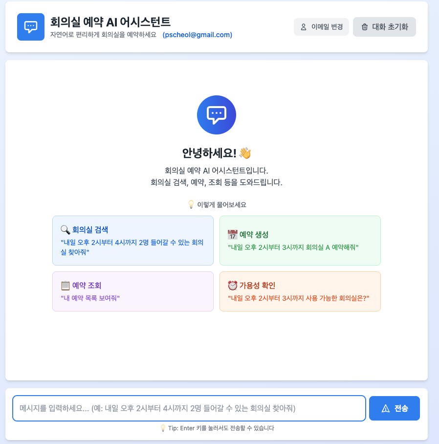
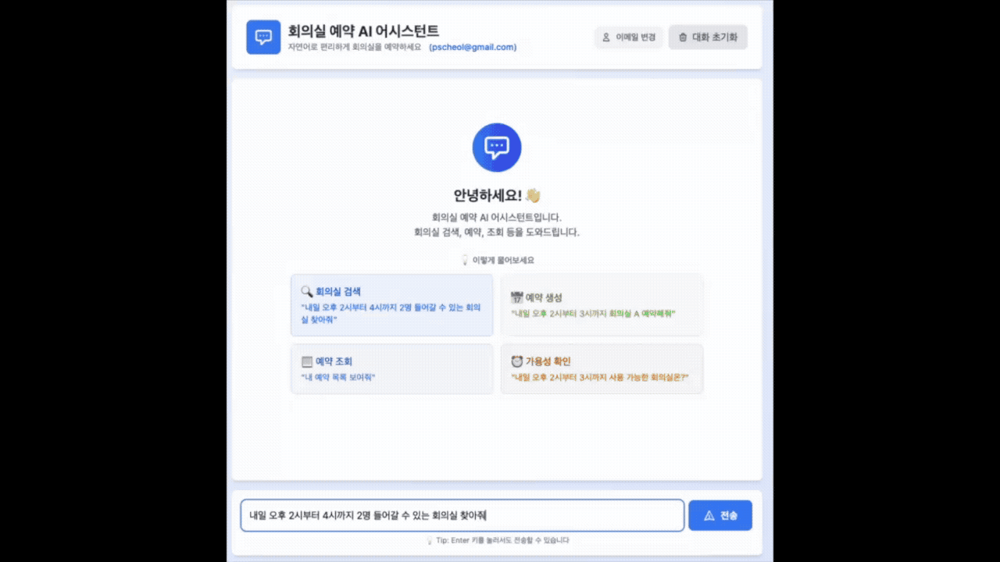

# 회의실 예약 LLM 서비스

> Multi-Agent 아키텍처 기반 회의실 예약 AI 챗봇 서비스

회의실을 검색하고 예약할 수 있는 AI 에이전트 시스템입니다. LangChain과 LangGraph를 활용한 Multi-Agent 패턴으로 구현되었으며, 사용자의 의도를 파악하여 적절한 에이전트가 작업을 처리합니다.

[//]: # (![page.png]&#40;docs/page.png&#41;)


## 📋 목차

- [프로젝트 개요](#-프로젝트-개요)
- [주요 기능](#-주요-기능)
- [아키텍처](#-아키텍처)
- [프로젝트 구조](#-프로젝트-구조)
- [기능 명세](#-기능-명세)
- [API 명세](#-api-명세)
- [실행 방법](#-실행-방법)
- [환경 설정](#-환경-설정)
- [개발 가이드](#-개발-가이드)

---

## 🎯 프로젝트 개요

### 개요

회의실 예약 시스템을 위한 Multi-Agent LLM 챗봇 서비스로, 사용자가 자연어로 회의실 예약, 조회, 수정, 취소 등의 작업을 수행할 수 있도록 지원합니다.

### 기술 스택

- **Python**: 3.12
- **프레임워크**: FastAPI, LangChain, LangGraph
- **LLM**: OpenAI GPT, Ollama, Upstage Solar (선택 가능)
- **API 연동**: room-reservation-service 백엔드 서비스

### 주요 특징

- ✅ **Multi-Agent 아키텍처**: 각 작업별 전문 에이전트가 독립적으로 동작
- ✅ **LangGraph 워크플로우**: 복잡한 예약 프로세스를 그래프 기반으로 관리 계층형 구조
- ✅ **다중 LLM 지원**: Ollama, OpenAI, Upstage 등 다양한 LLM 제공자 지원
- ✅ **스트리밍 응답**: 실시간 스트리밍 채팅 지원
- ✅ **세션 관리**: Local Memory or Redis 기반 대화 컨텍스트 유지

---

## 🌟 주요 기능

### 1. 회의실 검색 및 조회
- 자연어 기반 회의실 검색
- 특정 시간대 사용 가능한 회의실 조회
- 회의실 상세 정보 확인 (위치, 수용 인원, 설비)

### 2. 예약 관리
- **예약 생성**: 날짜, 시간, 참석자 정보 기반 예약
- **예약 조회**: 내 예약 내역, 특정 회의실 예약 현황
- **예약 취소**: 예약 삭제

### 3. 지능형 대화
- 사용자 의도 자동 파악
- 컨텍스트 기반 다단계 대화
- 자연스러운 한국어 응답

---

## 🏗️ 아키텍처

### 시스템 구조

```
┌─────────────────────────────────────────────────────────────┐
│                        사용자 (User)                          │
└────────────────────────┬────────────────────────────────────┘
                         │
                         ▼
┌─────────────────────────────────────────────────────────────┐
│                   FastAPI 웹 서버                             │
│  ┌──────────────┐  ┌──────────────┐  ┌──────────────┐       │
│  │  Chat API    │  │  Health API  │  │ Session API  │       │
│  └──────────────┘  └──────────────┘  └──────────────┘       │
└────────────────────────┬────────────────────────────────────┘
                         │
                         ▼
┌─────────────────────────────────────────────────────────────┐
│              ReservationOrchestrator                        │
│              (LangGraph 기반 워크플로우)                        │
│                                                             │
│  ┌──────────┐    ┌──────────┐    ┌──────────┐               │
│  │  Router  │───▶│  Intent  │───▶│ Execute  │               │
│  │  Agent   │    │  Check   │    │  Agent   │               │
│  └──────────┘    └──────────┘    └──────────┘               │
│                                                             │
│  Agents:                                                    │
│  ├─ RoomAgent         (회의실 검색)                            │
│  ├─ ReservationAgent  (예약 생성/수정/취소)                      │
│  ├─ QueryAgent        (예약 조회)                              │
│  └─ GeneralAgent      (일반 대화)                              │
└────────────────────────┬────────────────────────────────────┘
                         │
        ┌────────────────┼────────────────┐
        ▼                                 ▼
┌──────────────┐                   ┌──────────────┐ 
│   Backend    │                   │              │ 
│     API      │                   │   (Memory)   │ 
│              │                   │              │ 
└──────────────┘                   └──────────────┘ 
```

### Multi-Agent 패턴

각 에이전트는 **BaseAgent** 추상 클래스를 상속받아 독립적으로 동작하며, LangGraph를 통해 워크플로우가 조율됩니다.

```python
BaseAgent (추상 클래스)
├── RoomAgent           # 회의실 검색 및 조회
├── ReservationAgent    # 예약 생성/수정/취소
├── QueryAgent          # 예약 내역 조회
└── GeneralAgent        # 일반 대화 처리
```

### LangGraph 워크플로우

```
START → Router → Intent Check → Agent Selection → Execute → END
                      │                               │
                      └──────── Fallback ─────────────┘
```

---

## 📁 프로젝트 구조

```
reservation-llm-service/
├── apps/                           # 애플리케이션 소스 코드
│   ├── agents/                     # Multi-Agent 구현
│   │   ├── base_agent.py           # 에이전트 추상 클래스
│   │   ├── router.py               # 라우팅 에이전트
│   │   ├── room.py                 # 회의실 에이전트
│   │   ├── reservation.py          # 예약 에이전트
│   │   ├── query.py                # 조회 에이전트
│   │   └── general.py              # 일반 대화 에이전트
│   │
│   ├── api/                        # FastAPI 웹 서버
│   │   ├── app.py                  # 애플리케이션 팩토리
│   │   ├── server.py               # 서버 실행
│   │   ├── dependencies.py         # 의존성 주입
│   │   ├── models.py               # API 모델
│   │   └── routes/                 # API 엔드포인트
│   │       ├── chat.py             # 채팅 API
│   │       ├── health.py           # 헬스체크 API
│   │       ├── session.py          # 세션 관리 API
│   │       └── ui.py               # UI 라우터
│   │
│   ├── config/                     # 설정
│   │   ├── settings.py             # 환경 설정
│   │   └── llm_factory.py          # LLM 팩토리 패턴
│   │
│   ├── core/                       # 핵심 추상 클래스
│   │   ├── base_agent.py           # 에이전트 기본 클래스
│   │   ├── base_orchestrator.py    # 오케스트레이터 기본 클래스
│   │   ├── base_workflow.py        # 워크플로우 기본 클래스
│   │   ├── base_memory.py          # 메모리 기본 클래스
│   │   └── base_knowledge.py       # 지식 베이스 기본 클래스
│   │
│   ├── orchestrations/             # 오케스트레이터
│   │   ├── reservation_orchestrator.py  # 예약 오케스트레이터
│   │   └── reservation_dto.py      # DTO 모델
│   │
│   ├── workflow/                   # LangGraph 워크플로우
│   │   ├── reservation_workflow.py # 예약 워크플로우
│   │   ├── reservation_nodes.py    # 워크플로우 노드
│   │   └── agent_state.py          # 상태 관리
│   │
│   ├── tools/                      # LangChain 도구
│   │   ├── room_tools.py           # 회의실 도구
│   │   ├── reservation_tools.py    # 예약 도구
│   │   └── query_tools.py          # 조회 도구
│   │
│   ├── memory/                     # 메모리 저장소
│   │   ├── in_memory.py            # 인메모리 저장소
│   │   └── redis_memory.py         # Redis 저장소
│   │
│   ├── knowledge/                  # 지식 베이스
│   │   └── static_knowledge.py     # 정적 지식
│   │
│   ├── prompts/                    # 프롬프트 템플릿
│   │   └── templates.py            # 프롬프트 정의
│   │
│   └── utils/                      # 유틸리티
│       └── logger.py               # 로깅 설정
│
├── webapps/                        # 웹 리소스
│   ├── templates/                  # HTML 템플릿
│   │   └── index.html              # 채팅 UI
│   └── static/                     # 정적 파일
│
├── logs/                           # 로그 파일 (자동 생성)
├── tests/                          # 테스트 코드
├── log-config.ini                  # 로깅 설정
├── pyproject.toml                  # 프로젝트 메타데이터
├── main.py                         # 진입점
├── Makefile                        # 개발 명령어
├── .env.example                    # 환경 변수 예제
└── README.md                       # 프로젝트 문서 (이 파일)
```

---

## 📝 기능 명세

### 1. 사용자 의도 라우팅

| 기능 | 설명 | 담당 에이전트 |
|------|------|--------------|
| 의도 파악 | 사용자 입력에서 의도 추출 | RouterAgent |
| 에이전트 선택 | 의도에 맞는 에이전트 선택 | Orchestrator |
| 폴백 처리 | 불명확한 의도 처리 | GeneralAgent |

### 2. 회의실 관리

| 기능 | 설명 | 도구 |
|------|------|------|
| 회의실 검색 | 이름, 위치, 수용 인원으로 검색 | `search_rooms` |
| 가용 회의실 조회 | 특정 시간대 사용 가능한 회의실 | `get_available_rooms` |
| 회의실 상세 정보 | 특정 회의실의 상세 정보 | `get_room_details` |

### 3. 예약 관리

| 기능 | 설명 | 도구 |
|------|------|------|
| 예약 생성 | 회의실, 시간, 참석자 정보로 예약 | `create_reservation` |
| 예약 수정 | 시간 또는 참석자 변경 | `update_reservation` |
| 예약 취소 | 예약 삭제 | `cancel_reservation` |
| 예약 조회 | 예약 ID로 상세 정보 조회 | `get_reservation` |
| 예약 검색 | 날짜, 회의실, 사용자로 검색 | `search_reservations` |
| 다가오는 예약 | 사용자의 향후 예약 목록 | `get_upcoming_reservations` |

### 4. 대화 관리

| 기능 | 설명 | 구현 |
|------|------|------|
| 컨텍스트 유지 | 대화 히스토리 저장 및 활용 | Redis Memory |
| 세션 관리 | 세션별 대화 상태 관리 | Session API |
| 스트리밍 응답 | 실시간 응답 스트리밍 | SSE (Server-Sent Events) |

### 5. 외부 연동

| 기능 | 설명 | 연동 대상 |
|------|------|----------|
| 백엔드 API | 모든 데이터 작업 위임 | Spring Boot REST API |
| 구글 캘린더 | 예약 시 캘린더 이벤트 생성 | Google Calendar API |

---

## 🔌 API 명세

### Base URL
```
http://localhost:8000
```

### 엔드포인트

#### 1. 채팅 API

##### POST `/chat`
일반 채팅 (비스트리밍)

**Request Body:**
```json
{
  "message": "내일 오후 2시에 회의실 예약해줘",
  "session_id": "user-123",
  "user_email": "user@example.com"
}
```

**Response:**
```json
{
  "response": "회의실 예약이 완료되었습니다. 예약 번호는 R-001입니다.",
  "agent": "reservation"
}
```

##### POST `/chat/stream`
스트리밍 채팅

**Request Body:** (동일)

**Response:** SSE (Server-Sent Events)
```
data: {"type": "chunk", "content": "회의실을"}
data: {"type": "chunk", "content": " 찾고"}
data: {"type": "chunk", "content": " 있습니다"}
data: [DONE]
```

#### 2. 헬스체크 API

##### GET `/health`
서비스 상태 확인

**Response:**
```json
{
  "status": "healthy",
  "llm_provider": "ollama",
  "llm_model": "llama3.1:8b",
  "backend_url": "http://localhost:8080"
}
```

##### GET `/system/info`
시스템 정보 조회

**Response:**
```json
{
  "agents": ["room", "reservation", "query", "general"],
  "workflow": "langgraph",
  "memory": "redis"
}
```

#### 3. 세션 관리 API

##### GET `/session/{session_id}`
세션 정보 조회

**Response:**
```json
{
  "session_id": "user-123",
  "message_count": 5,
  "last_active": "2024-01-15T14:30:00"
}
```

##### DELETE `/session/{session_id}`
세션 초기화

**Response:**
```json
{
  "message": "세션 user-123이(가) 초기화되었습니다."
}
```

#### 4. UI

##### GET `/`
채팅 UI 페이지 (HTML)

---

## 🚀 실행 방법

### 사전 요구사항

1. **Python 3.12** 설치
2. **uv** 패키지 매니저 설치
   ```bash
   curl -LsSf https://astral.sh/uv/install.sh | sh
   ```
3. **백엔드 서비스** 실행 (필수)
   ```bash
   cd ../room-reservation-service
   ./gradlew bootRun
   ```
4. **LLM 서비스** 설정 (Ollama 사용 시)
   ```bash
   ollama pull llama3.1:8b
   ollama serve
   ```

### 1. 프로젝트 클론

```bash
git clone <repository-url>
cd reservation-llm-service
```

### 2. 환경 변수 설정

`.env` 파일 생성:

```bash
cp .env.example .env
```

`.env` 파일 편집:

```bash
# LLM 설정
LLM_PROVIDER=ollama
LLM_MODEL=llama3.1:8b
LLM_TEMPERATURE=0.7

# 백엔드 API
BACKEND_API_URL=http://localhost:8080

# Redis (선택)
REDIS_HOST=localhost
REDIS_PORT=6379

# API 서버
API_HOST=0.0.0.0
API_PORT=8000
```

### 3. 의존성 설치

```bash
# 프로덕션 의존성만
uv sync

# 개발 의존성 포함
uv sync --all-extras
```

### 4. 서비스 실행

```bash
# Makefile 사용
make run

# 또는 직접 실행
uv run python main.py
```

### 5. 서비스 확인

- **채팅 UI**: http://localhost:8000
- **API 문서**: http://localhost:8000/docs
- **헬스체크**: http://localhost:8000/health

### 6. 사용 예시

```bash
# 회의실 검색
curl -X POST "http://localhost:8000/chat" \
  -H "Content-Type: application/json" \
  -d '{
    "message": "내일 오후 2시에 10명이 사용할 수 있는 회의실 찾아줘",
    "session_id": "user-123",
    "user_email": "user@example.com"
  }'

# 예약 생성
curl -X POST "http://localhost:8000/chat" \
  -H "Content-Type: application/json" \
  -d '{
    "message": "회의실 1번을 내일 14시부터 16시까지 예약해줘. 제목은 개발팀 회의",
    "session_id": "user-123",
    "user_email": "user@example.com"
  }'
```

---

## ⚙️ 환경 설정

### LLM 제공자 설정

#### Ollama (기본값)

```bash
# 모델 다운로드
ollama pull llama3.1:8b

# 서버 실행
ollama serve
```

`.env`:
```bash
LLM_PROVIDER=ollama
LLM_MODEL=llama3.1:8b
OLLAMA_BASE_URL=http://localhost:11434
```

#### OpenAI

`.env`:
```bash
LLM_PROVIDER=openai
LLM_MODEL=gpt-4
OPENAI_API_KEY=sk-...
```

#### Upstage

`.env`:
```bash
LLM_PROVIDER=upstage
LLM_MODEL=solar-mini
UPSTAGE_API_KEY=up_...
```

### Redis 설정 (선택)

```bash
# Docker로 Redis 실행
docker run -d -p 6379:6379 redis:latest
```

`.env`:
```bash
REDIS_HOST=localhost
REDIS_PORT=6379
REDIS_PASSWORD=
```

### 로깅 설정

로그는 `logs/` 디렉토리에 자동으로 저장됩니다:

- **로테이션**: 매일 자정에 새 파일 생성
- **압축**: 이전 로그는 gzip으로 자동 압축
- **보관 기간**: 최대 30일
- **설정 파일**: `log-config.ini`

```ini
# 로그 레벨 변경
[logger_root]
level=INFO

# 파일 핸들러 설정
[handler_fileHandler]
args=('logs/app.log', 'midnight', 1, 30, 'utf-8')
```

### 시연 연상

