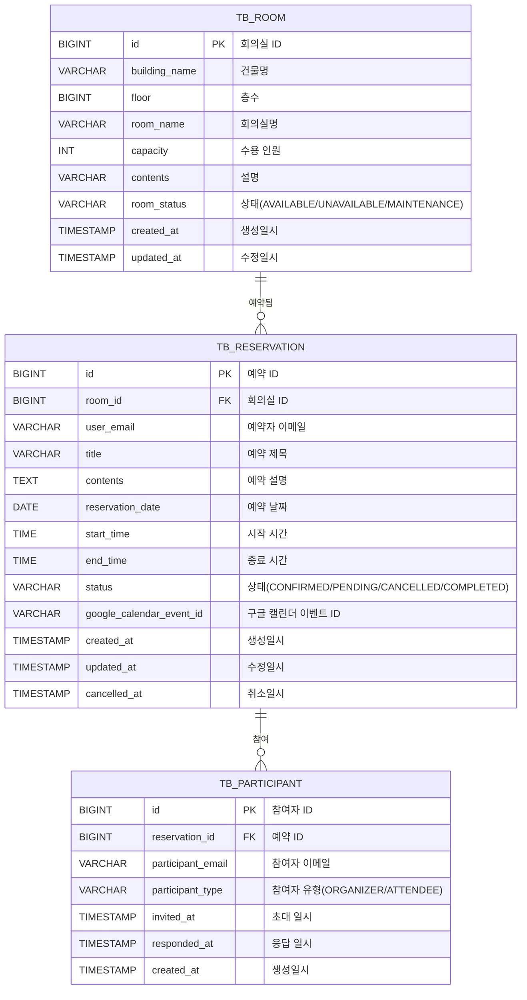

# 회의실 예약 시스템 (Room Reservation System)

회의실 예약 관리를 위한 백엔드 API 서비스로. 헥사고날 아키텍처와 DDD 활용

## 📋 목차

- [기술 스택](#기술-스택)
- [아키텍처](#아키텍처)
- [프로젝트 구조](#프로젝트-구조)
- [데이터베이스 설계](#데이터베이스-설계)
- [API 명세](#api-명세)
- [빌드 및 실행](#빌드-및-실행)
- [테스트](#테스트)

---

## 🛠 기술 스택

### Backend
- **Language**: Kotlin 2.3.0, Java 25
- **Framework**: Spring Boot 4.0.2 (MVC)
- **Database**:
  - H2
  - PostgreSQL 17+
- **API Documentation**: SpringDoc OpenAPI (Swagger UI)
- 
- **Messaging**: Apache Kafka 4.x
- **Cache**: Spring Data Redis
- **Resilience**: Resilience4j (Circuit Breaker)

### Testing
- **Test Framework**: Kotest
- **Mocking**: MockK

### AI/RAG (계획)
- Python 3.12+
- LangChain 1.x
- LangGraph (Multi-Agent AI)
- PGVector 17+ (벡터 DB)

---

## 🏗 아키텍처

### 헥사고날 아키텍처 (Ports and Adapters)

**헥사고날 아키텍처**와 **DDD** 패턴을 적용.

```
┌─────────────────────────────────────────────────────┐
│               Primary Adapters                   │
│         (REST Controllers - Inbound)                │
└───────────────────┬─────────────────────────────────┘
                    │
                    ▼
┌─────────────────────────────────────────────────────┐
│               Application Layer                     │
│  (Use Cases, Commands, Queries, Port Interfaces)    │
└───────────────────┬─────────────────────────────────┘
                    │
                    ▼
┌─────────────────────────────────────────────────────┐
│                 Domain Layer                        │
│    (Aggregates, Value Objects, Domain Services)     │
└───────────────────┬─────────────────────────────────┘
                    │
                    ▼
┌─────────────────────────────────────────────────────┐
│              Secondary Adapters                     │
│      (JPA Repositories, Mappers - Outbound)         │
└─────────────────────────────────────────────────────┘
```

### 계층 의존성 규칙

```
adapter.primary (Web)
    ↓ (depends on)
application (Use Cases)
    ↓ (depends on)
domain (Core Business Logic)
    ↑ (implements)
application.output (Ports)
    ↑ (implements)
adapter.secondary (Persistence)
```
---


## 📁 프로젝트 구조

```
src/main/kotlin/com/devpaik/metting/
├── adapter/
│   ├── primary/web/                    # 인바운드 어댑터 (REST API)
│   │   ├── ReservationController.kt   # 예약 관리 API
│   │   ├── RoomController.kt          # 회의실 관리 API
│   │   ├── dto/                       # Request/Response DTO
│   │   │   ├── ReservationDto.kt
│   │   │   ├── RoomDto.kt
│   │   │   └── ParticipantDto.kt
│   │   └── docs/                      # Swagger 문서화
│   │       ├── ReservationAPI.kt
│   │       └── RoomAPI.kt
│   │
│   └── secondary/persistence/         # 아웃바운드 어댑터 (영속성)
│       ├── entity/                    # JPA 엔티티
│       │   ├── TbRoom.kt
│       │   ├── TbReservation.kt
│       │   └── TbParticipant.kt
│       ├── repository/                # Spring Data JPA Repository
│       │   ├── TbRoomRepository.kt
│       │   └── TbReservationRepository.kt
│       ├── mapper/                    # 엔티티 ↔ 도메인 변환
│       │   ├── RoomMapper.kt
│       │   └── ReservationMapper.kt
│       └── adapter/                   # 포트 구현체
│           ├── TbRoomAdapter.kt
│           └── TbReservationAdapter.kt
│
├── application/                       # 애플리케이션 계층
│   ├── room/
│   │   ├── config/RoomConfig.kt
│   │   ├── output/                    # Output Port 인터페이스
│   │   │   ├── LoadRoomPort.kt
│   │   │   ├── SaveRoomPort.kt
│   │   │   └── DeleteRoomPort.kt
│   │   └── usecase/                   # Use Case 인터페이스 및 구현
│   │       ├── CreateRoomUseCase.kt
│   │       ├── QueryRoomUseCase.kt
│   │       ├── command/RoomCommands.kt
│   │       ├── query/RoomQuery.kt
│   │       └── service/
│   │           ├── ManageRoomService.kt
│   │           └── QueryRoomService.kt
│   │
│   └── reservation/
│       ├── config/ReservationConfig.kt
│       ├── output/                    # Output Port 인터페이스
│       │   ├── LoadReservationPort.kt
│       │   ├── SaveReservationPort.kt
│       │   └── CheckReservationPort.kt
│       └── usecase/                   # Use Case 인터페이스 및 구현
│           ├── CreateReservationUseCase.kt
│           ├── QueryReservationUseCase.kt
│           ├── command/
│           │   ├── CreateReservationCommand.kt
│           │   └── UpdateReservationCommand.kt
│           ├── query/ReservationQuery.kt
│           └── service/
│               ├── CreateReservationService.kt
│               └── QueryReservationService.kt
│
├── domain/                            # 도메인 계층 (핵심 비즈니스 로직)
│   ├── common/vo/                     # 공통 Value Object
│   │   ├── RoomId.kt
│   │   ├── UserEmail.kt
│   │   └── Floor.kt
│   │
│   ├── room/                          # 회의실 도메인
│   │   ├── aggregate/
│   │   │   ├── Room.kt               # Aggregate Root
│   │   │   └── vo/                   # Value Objects
│   │   │       ├── RoomStatus.kt
│   │   │       ├── RoomCapacity.kt
│   │   │       ├── RoomName.kt
│   │   │       └── BuildingName.kt
│   │   ├── service/                  # Domain Services
│   │   │   ├── RoomMatcher.kt
│   │   │   └── strategy/
│   │   │       └── OptimalCapacityMatchingStrategy.kt
│   │   └── exception/RoomDomainException.kt
│   │
│   ├── reservation/                   # 예약 도메인
│   │   ├── aggregate/
│   │   │   ├── Reservation.kt        # Aggregate Root
│   │   │   └── vo/                   # Value Objects
│   │   │       ├── ReservationId.kt
│   │   │       ├── ReservationStatus.kt
│   │   │       ├── ReservationPeriod.kt
│   │   │       └── ReservationTitle.kt
│   │   ├── service/                  # Domain Services
│   │   │   ├── ReservationFactory.kt
│   │   │   ├── ReservationValidator.kt
│   │   │   └── ReservationUpdater.kt
│   │   └── exception/ReservationDomainException.kt
│   │
│   └── participant/                   # 참여자 도메인
│       ├── aggregate/
│       │   ├── Participant.kt        # Aggregate Root
│       │   └── vo/                   # Value Objects
│       │       ├── ParticipantId.kt
│       │       ├── ParticipantEmail.kt
│       │       └── ParticipantType.kt
│
├── config/
│   └── SwaggerConfig.kt              # Swagger 설정
│
└── RoomReservationServiceApplication.kt
```

---

## 🗄 데이터베이스 설계

### ERD (Entity Relationship Diagram)



### 테이블 명세

#### 1. TB_ROOM (회의실)

| 컬럼명 | 타입 | 제약조건 | 설명 |
|--------|------|----------|------|
| id | BIGINT | PK, AUTO_INCREMENT | 회의실 ID |
| building_name | VARCHAR(100) | NOT NULL | 건물명 |
| floor | BIGINT | NOT NULL | 층수 |
| room_name | VARCHAR(100) | NOT NULL | 회의실명 |
| capacity | INT | NOT NULL, CHECK(1~100) | 수용 인원 |
| contents | VARCHAR(500) | NULL | 회의실 설명 |
| room_status | VARCHAR(20) | NOT NULL, DEFAULT 'AVAILABLE' | 회의실 상태 |
| created_at | TIMESTAMP | NOT NULL | 생성일시 |
| updated_at | TIMESTAMP | NOT NULL | 수정일시 |

**ENUM 값:**
- `room_status`: `AVAILABLE`, `UNAVAILABLE`, `MAINTENANCE`

**인덱스:**
- `idx_room_status`: (room_status)
- `idx_room_capacity`: (capacity)
- `idx_room_building_floor`: (building_name, floor)

---

#### 2. TB_RESERVATION (예약)

| 컬럼명 | 타입 | 제약조건 | 설명 |
|--------|------|----------|------|
| id | BIGINT | PK, AUTO_INCREMENT | 예약 ID |
| room_id | BIGINT | FK(tb_room.id), NOT NULL | 회의실 ID |
| user_email | VARCHAR(100) | NOT NULL | 예약자 이메일 |
| title | VARCHAR(200) | NOT NULL | 예약 제목 |
| contents | TEXT | NULL | 예약 설명 |
| reservation_date | DATE | NOT NULL | 예약 날짜 |
| start_time | TIME | NOT NULL | 시작 시간 |
| end_time | TIME | NOT NULL | 종료 시간 |
| status | VARCHAR(20) | NOT NULL, DEFAULT 'CONFIRMED' | 예약 상태 |
| google_calendar_event_id | VARCHAR(500) | NULL | 구글 캘린더 이벤트 ID |
| created_at | TIMESTAMP | NOT NULL | 생성일시 |
| updated_at | TIMESTAMP | NOT NULL | 수정일시 |
| cancelled_at | TIMESTAMP | NULL | 취소일시 |

**ENUM 값:**
- `status`: `CONFIRMED`, `PENDING`, `CANCELLED`, `COMPLETED`

**제약조건:**
- `CHECK (end_time > start_time)`

**인덱스:**
- `idx_reservation_room_date_time`: (room_id, reservation_date, start_time, end_time) WHERE status != 'CANCELLED'
- `idx_reservation_user_email`: (user_email)
- `idx_reservation_date`: (reservation_date)
- `idx_reservation_status`: (status)

---

#### 3. TB_PARTICIPANT (참여자)

| 컬럼명 | 타입 | 제약조건 | 설명 |
|--------|------|----------|------|
| id | BIGINT | PK, AUTO_INCREMENT | 참여자 ID |
| reservation_id | BIGINT | FK(tb_reservation.id), NOT NULL | 예약 ID |
| participant_email | VARCHAR(100) | NOT NULL | 참여자 이메일 |
| participant_type | VARCHAR(20) | NOT NULL, DEFAULT 'ATTENDEE' | 참여자 유형 |
| invited_at | TIMESTAMP | NOT NULL | 초대 일시 |
| responded_at | TIMESTAMP | NULL | 응답 일시 |
| created_at | TIMESTAMP | NOT NULL | 생성일시 |

**ENUM 값:**
- `participant_type`: `ORGANIZER`, `ATTENDEE`

**제약조건:**
- `UNIQUE (reservation_id, participant_email)` - 동일 예약 내 이메일 중복 방지

**인덱스:**
- `idx_participant_reservation`: (reservation_id)
- `idx_participant_email`: (participant_email)

---

### 주요 비즈니스 규칙

#### 회의실 예약 규칙
- ✅ 예약 가능 시간: **06:00 ~ 23:00**
- ✅ 예약 기간: **현재일 ~ 3개월 이내**
- ✅ 최소 예약 시간: **30분**
- ✅ 최대 예약 시간: **8시간**
- ✅ 예약 취소: **시작 10분 전까지만 가능**

#### 회의실 상태
- `AVAILABLE`: 사용 가능
- `UNAVAILABLE`: 사용 불가
- `MAINTENANCE`: 정비 중

#### 예약 상태
- `CONFIRMED`: 예약 확정
- `PENDING`: 승인 대기
- `CANCELLED`: 취소됨
- `COMPLETED`: 완료됨

---

## 📡 API 명세

### Swagger UI
서버 실행 후 아래 URL에서 API 문서를 확인할 수 있습니다.
```
http://localhost:8080/swagger-ui.html
```

---

### 1. 예약 API (Reservation)

#### 1.1 예약 생성
```http
POST /api/reservations
Content-Type: application/json

{
  "roomId": 1,
  "email": "user@example.com",
  "title": "개발팀 회의",
  "contents": "Sprint 계획 회의",
  "reservationDate": "2026-02-05",
  "startTime": "14:00:00",
  "endTime": "15:30:00",
  "participants": [
    {
      "email": "participant1@example.com",
      "type": "ATTENDEE"
    },
    {
      "email": "participant2@example.com",
      "type": "ATTENDEE"
    }
  ]
}
```

**Response (201 Created)**
```json
{
  "id": 1,
  "room": {
    "id": 1,
    "buildingName": "본사",
    "floor": 3,
    "roomName": "회의실 A"
  },
  "userEmail": "user@example.com",
  "title": "개발팀 회의",
  "contents": "Sprint 계획 회의",
  "reservationDate": "2026-02-05",
  "startTime": "14:00:00",
  "endTime": "15:30:00",
  "status": "CONFIRMED",
  "participants": [
    {
      "id": 1,
      "email": "participant1@example.com",
      "type": "ATTENDEE",
      "invitedAt": "2026-02-03T10:30:00"
    }
  ],
  "createdAt": "2026-02-03T10:30:00",
  "updatedAt": "2026-02-03T10:30:00"
}
```

---

#### 1.2 예약 조회
```http
GET /api/reservations/{id}
```

**Response (200 OK)**
```json
{
  "id": 1,
  "room": {
    "id": 1,
    "buildingName": "본사",
    "floor": 3,
    "roomName": "회의실 A"
  },
  "userEmail": "user@example.com",
  "title": "개발팀 회의",
  "reservationDate": "2026-02-05",
  "startTime": "14:00:00",
  "endTime": "15:30:00",
  "status": "CONFIRMED",
  "participants": [...],
  "createdAt": "2026-02-03T10:30:00",
  "updatedAt": "2026-02-03T10:30:00"
}
```

---

#### 1.3 예약 수정
```http
PUT /api/reservations/{id}
Content-Type: application/json

{
  "title": "개발팀 주간 회의",
  "contents": "Sprint Retrospective",
  "reservationDate": "2026-02-05",
  "startTime": "15:00:00",
  "endTime": "16:00:00",
  "status": "CONFIRMED"
}
```

**Response (200 OK)**
```json
{
  "id": 1,
  "room": {...},
  "title": "개발팀 주간 회의",
  ...
}
```

---

#### 1.4 예약 취소
```http
DELETE /api/reservations/{id}?email=user@example.com
```

**Response (204 No Content)**

---

#### 1.5 예약 검색
```http
GET /api/reservations?email={email}&roomName={roomName}&buildingName={buildingName}&startDate={startDate}&endDate={endDate}&status={status}
```

**Query Parameters:**
- `email` (optional): 예약자 이메일
- `roomName` (optional): 회의실명
- `buildingName` (optional): 건물명
- `startDate` (optional): 검색 시작 날짜 (yyyy-MM-dd)
- `endDate` (optional): 검색 종료 날짜 (yyyy-MM-dd)
- `status` (optional): 예약 상태

**Response (200 OK)**
```json
[
  {
    "id": 1,
    "room": {...},
    "userEmail": "user@example.com",
    "title": "개발팀 회의",
    "reservationDate": "2026-02-05",
    ...
  }
]
```

---

#### 1.6 예정된 예약 조회
```http
GET /api/reservations/upcoming?email={email}
```

**Response (200 OK)**
```json
[
  {
    "id": 1,
    "room": {...},
    "title": "개발팀 회의",
    "reservationDate": "2026-02-05",
    "startTime": "14:00:00",
    ...
  }
]
```

---

### 2. 회의실 API (Room)

#### 2.1 회의실 조회
```http
GET /api/rooms/{roomId}
```

**Response (200 OK)**
```json
{
  "id": 1,
  "buildingName": "본사",
  "floor": 3,
  "roomName": "회의실 A",
  "capacity": 10,
  "contents": "프로젝터, 화이트보드 구비",
  "status": "AVAILABLE",
  "createdAt": "2026-01-01T00:00:00",
  "updatedAt": "2026-01-01T00:00:00"
}
```

---

#### 2.2 회의실 검색
```http
GET /api/rooms?buildingName={buildingName}&floor={floor}&minCapacity={minCapacity}&status={status}
```

**Query Parameters:**
- `buildingName` (optional): 건물명
- `floor` (optional): 층수
- `minCapacity` (optional): 최소 수용 인원
- `status` (optional): 회의실 상태

**Response (200 OK)**
```json
[
  {
    "id": 1,
    "buildingName": "본사",
    "floor": 3,
    "roomName": "회의실 A",
    "capacity": 10,
    "status": "AVAILABLE",
    ...
  }
]
```

---

#### 2.3 사용 가능한 회의실 조회
```http
GET /api/rooms/available?date={date}&startTime={startTime}&endTime={endTime}&capacity={capacity}
```

**Query Parameters:**
- `date` (required): 예약 날짜 (yyyy-MM-dd)
- `startTime` (required): 시작 시간 (HH:mm:ss)
- `endTime` (required): 종료 시간 (HH:mm:ss)
- `capacity` (optional): 필요 인원

**Response (200 OK)**
```json
[
  {
    "id": 1,
    "buildingName": "본사",
    "floor": 3,
    "roomName": "회의실 A",
    "capacity": 10,
    "status": "AVAILABLE",
    ...
  }
]
```

---

#### 2.4 예약 가능 여부 확인
```http
GET /api/rooms/check-availability?roomId={roomId}&date={date}&startTime={startTime}&endTime={endTime}
```

**Response (200 OK)**
```json
{
  "available": true
}
```
또는
```json
{
  "available": false
}
```

---

#### 2.5 회의실 생성
```http
POST /api/rooms
Content-Type: application/json

{
  "buildingName": "본사",
  "floor": 3,
  "roomName": "회의실 B",
  "capacity": 8,
  "contents": "소회의실, 모니터 구비"
}
```

**Response (201 Created)**
```json
{
  "id": 2,
  "buildingName": "본사",
  "floor": 3,
  "roomName": "회의실 B",
  "capacity": 8,
  "contents": "소회의실, 모니터 구비",
  "status": "AVAILABLE",
  "createdAt": "2026-02-03T10:30:00",
  "updatedAt": "2026-02-03T10:30:00"
}
```

---

#### 2.6 회의실 수정
```http
PUT /api/rooms/{id}
Content-Type: application/json

{
  "roomName": "회의실 B (리모델링)",
  "capacity": 12,
  "contents": "프로젝터, 화상회의 장비 추가",
  "makeUnavailable": false,
  "startMaintenance": false,
  "makeAvailable": true
}
```

**Response (200 OK)**
```json
{
  "id": 2,
  "roomName": "회의실 B (리모델링)",
  "capacity": 12,
  "status": "AVAILABLE",
  ...
}
```

---

#### 2.7 회의실 삭제
```http
DELETE /api/rooms/{id}
```

**Response (204 No Content)**

---

## 🚀 빌드 및 실행

### 사전 요구사항
- Java 25
- Gradle 8.x

### 프로젝트 빌드
```bash
# 프로젝트 빌드
./gradlew build

# 클린 빌드
./gradlew clean build
```

### 애플리케이션 실행
```bash
./gradlew bootRun
```

서버가 시작되면 다음 URL로 접속:
- **애플리케이션**: http://localhost:8080
- **Swagger UI**: http://localhost:8080/swagger-ui.html

---

## 🧪 테스트

### 전체 테스트 실행
```bash
./gradlew test
```

